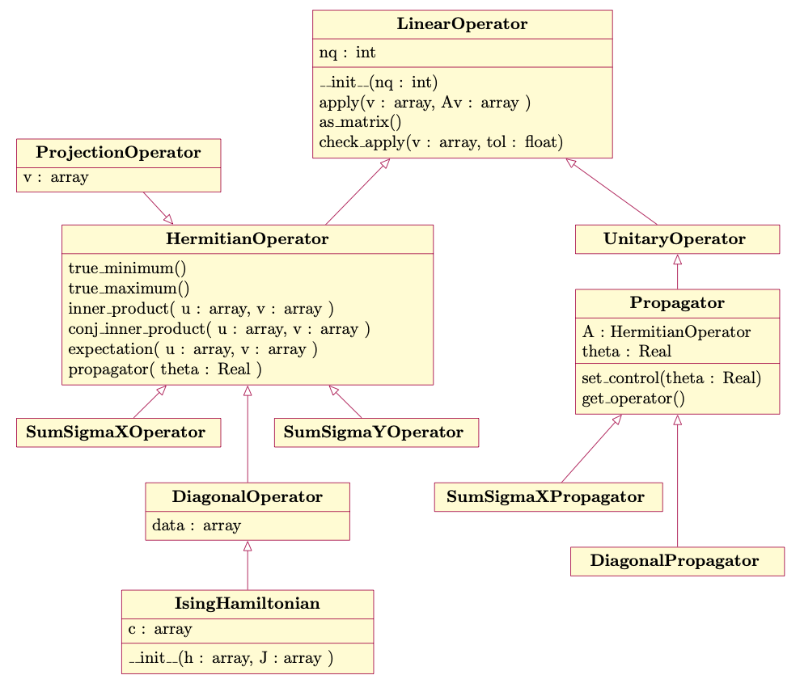

operators
=========

Operator classes encapsulate the action of matrix-vector multiplication in numerially
efficient ways that generally do not require forming the matrix and take advantage of
parallelism.

   Simplified hierarchy of Operator classes

.. toctree::
    :maxdepth: 1
    :caption: Linear Operators on Qubits

    operators/LinearOperator
    operators/HermitianOperator
    operators/UnitaryOperator
    operators/DiagonalOperator
    operators/ProjectionOperator
    operators/IsingHamiltonian
    operators/SumSigmaXOperator
    operators/SumSigmaYOperator
    operators/Propagator
